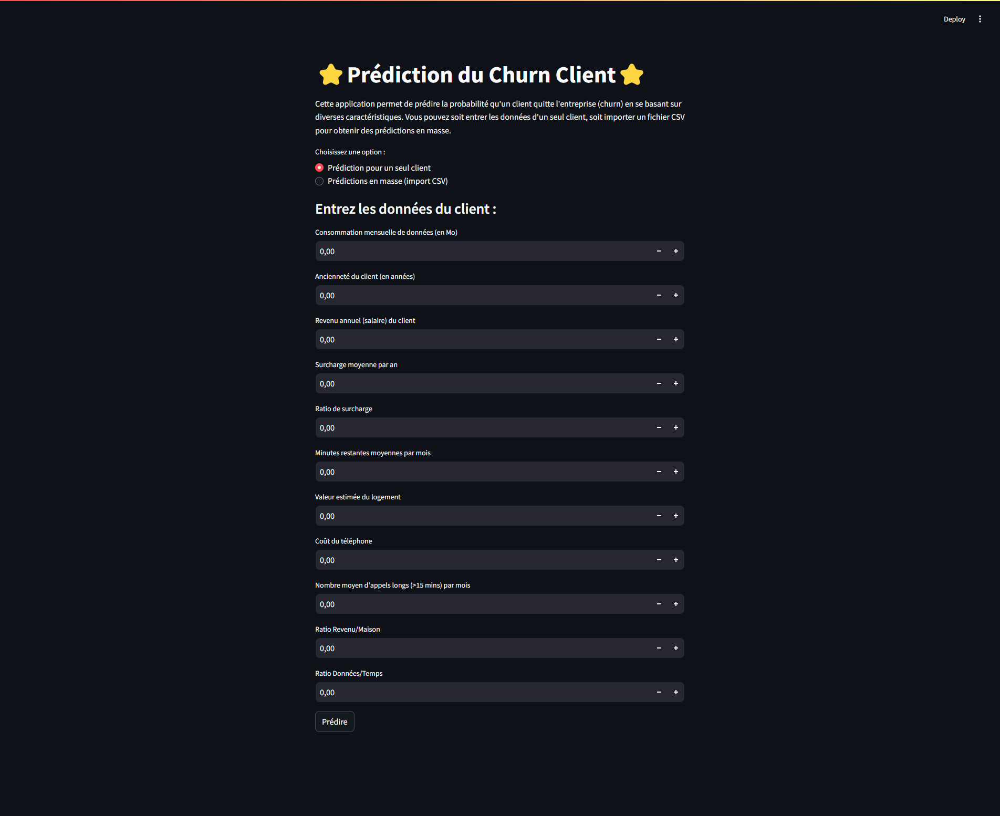
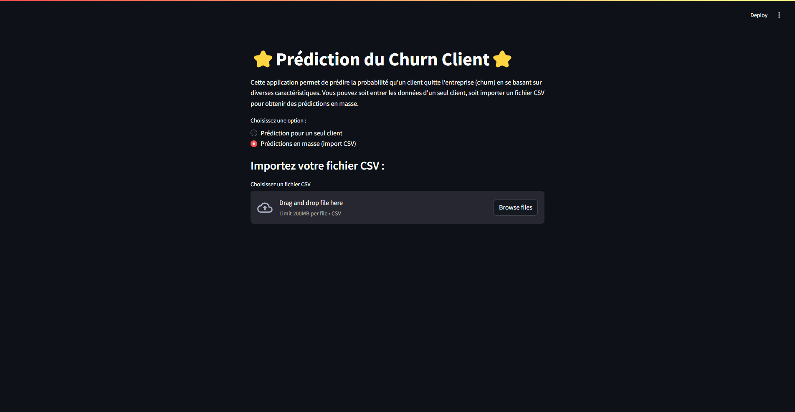

# TelcoChurn-ML-Predictor

## Description
Ce projet vise à prédire le churn (attrition) des clients d'une entreprise de télécommunications en utilisant des techniques avancées de machine learning. Il comprend une analyse exploratoire des données, le développement d'un modèle prédictif, et une interface utilisateur interactive pour les prédictions en temps réel.

## Aperçu de l'Interface Utilisateur

### Prédiction pour un seul client

### Prédictions en masse (import CSV)

## Fonctionnalités
- Analyse exploratoire des données (EDA) approfondie
- Prétraitement des données et ingénierie des caractéristiques
- Modélisation avec XGBoost et optimisation des hyperparamètres
- Évaluation du modèle avec validation croisée et analyse ROC
- Interface utilisateur Streamlit pour des prédictions interactives
- Calcul de recommandations de remises personnalisées

## Technologies Utilisées
- Python
- Pandas, NumPy pour la manipulation des données
- Scikit-learn, XGBoost pour le machine learning
- Matplotlib, Seaborn pour la visualisation
- Streamlit pour l'interface utilisateur

## Installation et Utilisation
1. Clonez le dépôt
2. Installez les dépendances : `pip install -r requirements.txt`
3. Exécutez le notebook Jupyter pour l'analyse et la modélisation
4. Lancez l'application Streamlit : `streamlit run app.py`

## Structure du Projet
- `notebook.ipynb`: Notebook Jupyter pour l'analyse et la modélisation
- `app.py`: Application Streamlit pour l'interface utilisateur
- `data/`: Dossier contenant les données (non inclus dans le dépôt)
- `models/`: Modèles entraînés sauvegardés
- `images/`: Captures d'écran de l'interface utilisateur

## Contribution
Les contributions sont les bienvenues ! N'hésitez pas à ouvrir une issue ou à soumettre une pull request.

## Licence
Ce projet est sous licence MIT. Voir le fichier `LICENSE` pour plus de détails.